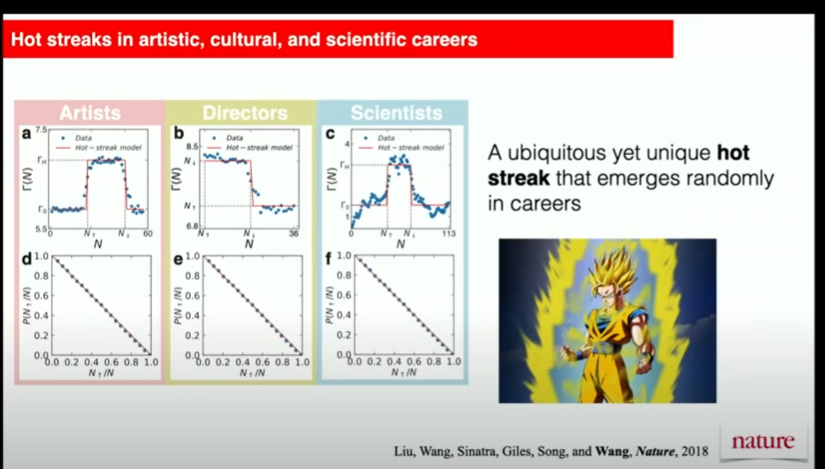

- The output of a researcher goes through phase changes. 
- [Wang Dashun](https://www.youtube.com/watch?v=r1IpNuoB5GQ)

- 统计滤波会根据随机过程建模去解构不确定性；控制工程会通过微分方程建模去描述一个动态系统。这些建模的思维方法训练过程长，对抽象思维要求高，是值得花时间打磨的技能。
- [Clarity of Thoughts](https://youtube.com/clip/Ugkx55r4O5-H9VYE7nKBHkkw2rl17WcwXaKd)
- Reduce the problem to its simplest form and go from there.
- Think about the performance over extreme condictions.
- Can we decompose a complicated system? Can we hedge for the undesirable part?